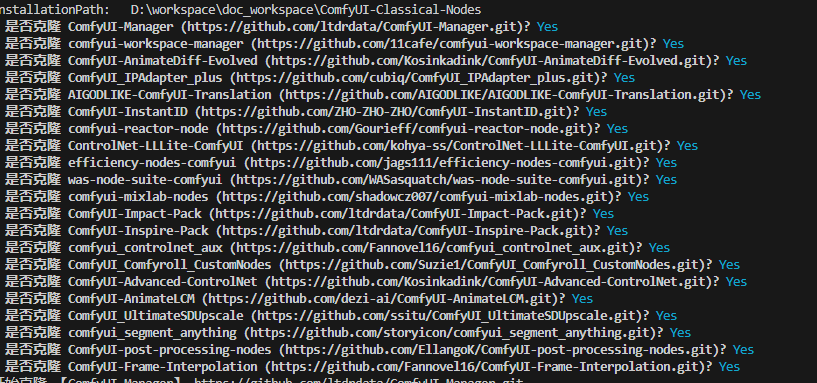

# ComfyUI-Classical-Nodes
Smart [ComfyUI](https://github.com/comfyanonymous/ComfyUI)  Custom Nodes

### ComfyUI
|Name|Discription|
|---|---|
|[ComfyUI](https://github.com/comfyanonymous/ComfyUI)|Main Program|


### Custom Nodes
||Name|Description|Recommend Index|
|---|---|---|---|
|1|[ComfyUI-Manager](https://github.com/ltdrdata/ComfyUI-Manager)|Custom Nodes Manager|☆☆☆☆☆|
|2|[comfyui-workspace-manager](https://github.com/11cafe/comfyui-workspace-manager)|workflow Management Tool|☆☆☆☆☆|
|3|[ComfyUI-AnimateDiff-Evolved](https://github.com/Kosinkadink/ComfyUI-AnimateDiff-Evolved)|AnimateDiff Video Node|☆☆☆☆|
|4|[ComfyUI_IPAdapter_plus](https://github.com/cubiq/ComfyUI_IPAdapter_plus)|IPAdapter Node|☆☆☆☆|
|5|[AIGODLIKE-ComfyUI-Translation](https://github.com/AIGODLIKE/AIGODLIKE-ComfyUI-Translation)|Translate Node|☆☆☆|
|6|[ComfyUI-InstantID](https://github.com/ZHO-ZHO-ZHO/ComfyUI-InstantID)|InstantID Implementation|☆☆☆☆|
|7|[comfyui-reactor-node](https://github.com/Gourieff/comfyui-reactor-node)|Face Swap Node|☆☆☆☆|
|8|[ControlNet-LLLite-ComfyUI](https://github.com/kohya-ss/ControlNet-LLLite-ComfyUI)|ControlNet-LLLite Implementation|☆☆☆|
|9|[efficiency-nodes-comfyui](https://github.com/jags111/efficiency-nodes-comfyui)|Useful efficiency Node|☆☆☆☆☆|
|10|[was-node-suite-comfyui](https://github.com/WASasquatch/was-node-suite-comfyui)|Over 190+ Nodes|☆☆☆☆|
|11|[comfyui-mixlab-nodes](https://github.com/shadowcz007/comfyui-mixlab-nodes)|Support workflow to APP|☆☆☆☆|
|12|[ComfyUI-Impact-Pack](https://github.com/ltdrdata/ComfyUI-Impact-Pack)|Support|☆☆☆☆|
|13|[ComfyUI-Inspire-Pack](https://github.com/ltdrdata/ComfyUI-Inspire-Pack)|Suppor XYZ|☆☆☆|
|14|[comfyui_controlnet_aux](https://github.com/Fannovel16/comfyui_controlnet_aux)|Controlnet Preprocessors|☆☆☆☆|
|15|[ComfyUI_Comfyroll_CustomNodes](https://github.com/Suzie1/ComfyUI_Comfyroll_CustomNodes)|more basic effective nodes|☆☆☆|
|16|[ComfyUI-Advanced-ControlNet](https://github.com/Kosinkadink/ComfyUI-Advanced-ControlNet)|controlnet executive nodes|☆☆☆☆☆|
|17|[ComfyUI-AnimateLCM](https://github.com/dezi-ai/ComfyUI-AnimateLCM)|AnimateLCM Implementation|☆☆☆|
|18|[ComfyUI_UltimateSDUpscale](https://github.com/ssitu/ComfyUI_UltimateSDUpscale)|Upscaler Nodes|☆☆☆|
|19|[comfyui_segment_anything](https://github.com/storyicon/comfyui_segment_anything)|Segment by text Nodes|☆☆☆☆|
|20|[ComfyUI-post-processing-nodes](https://github.com/EllangoK/ComfyUI-post-processing-nodes)|Post processor Nodes|☆☆☆☆|
|21|[ComfyUI-Frame-Interpolation](https://github.com/Fannovel16/ComfyUI-Frame-Interpolation)|Video Frame Interpolation Nodes|☆☆☆☆|

### Installation Nodes (Batch)
#### Prerequisites
You have installed NodeJS

verify NodeJS environment
```
node --version
npm --version
```

### Modify ComfyUI Installation Path
Modify `ComfyUI_path.txt` which under `custom_nodes` directory. Clear content, write your real ComfyUI Installtion Path. Eg: T:\ai\comfyui-portable\ComfyUI

### Installation Nodes
execute run.bat shell

Windows
```
cd ComfyUI-Classical-Nodes
.\run.bat
```

Linux/MacOS
```
cd ComfyUI-Classical-Nodes
chmod +x run.sh
./run.sh
```




